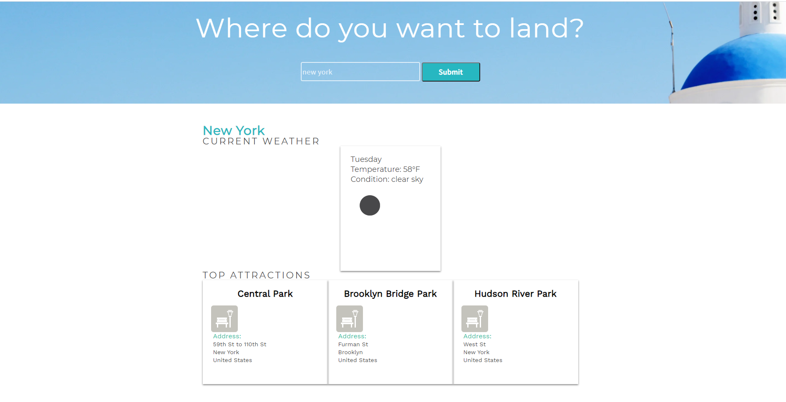

  

# Wunderlust-Project

## Description
 ---
 
 Using fetch, async, and await, the user should be able to request information from the Foursquare API and OpenWeather API to create a travel website. The basic idea and original code for this app was provided by Codecademy.
## Install 
---

  If you wish to run the app without a web browser you will need to download node.js. If you do not wish to download node, you can simply use the inspect tool in your web browser.  
## Contributing 
---

 If you wish to use this code or work together feel free to reach out to me directly. 
## Usage 
---

 To be able to better plan trips or flights to distance locations. 
## Tests
---

 No tests were run on this project.
## License 
---

 MIT License license(s) 
## Questions 
---

  if you have any questions feel free to reach out to me at [My Github](https://github.com/tylerdahl123) or feel free to email me at [My Email](dahlgren15@gmail.com) 
    
    